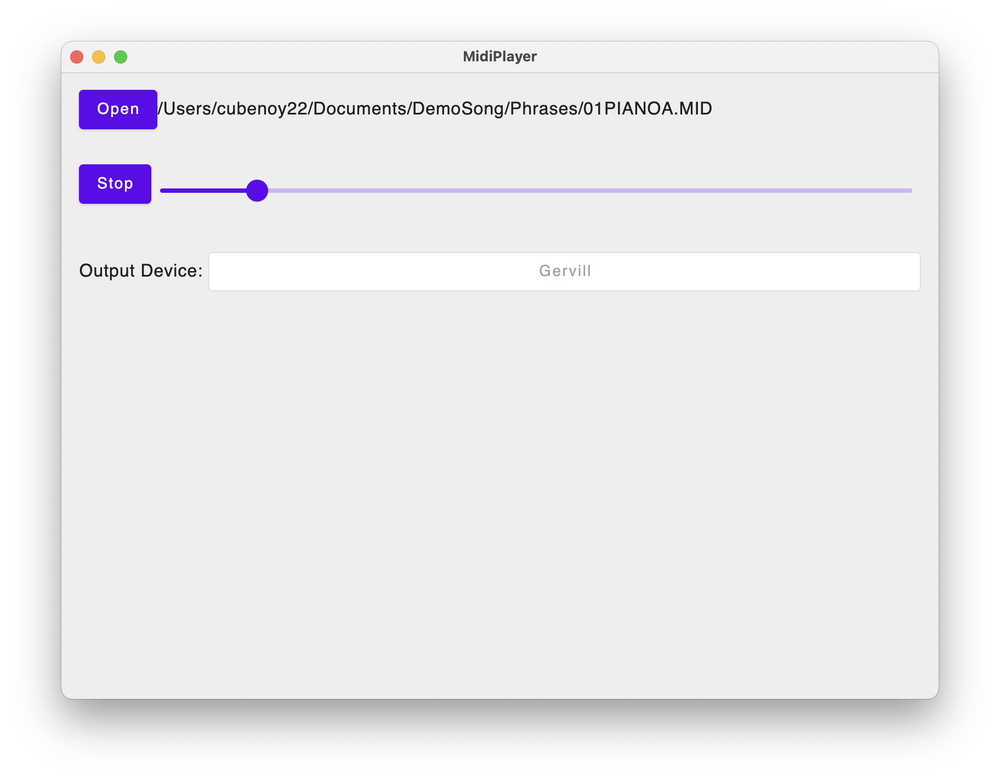

# jc4d-smf-player

This is a very simple SMF (Standard MIDI File) player with Jetpack Compose Desktop.

## How to Use

1. Click Open button to select any SMF.
1. Select MIDI Output device if needed. (you can't change it during playing)
1. Click Play button.
1. Slider shows current position of the player. 

## How to Build

Just use `packageUberJarForCurrentOS` gradle task for Multiplatform targets.
